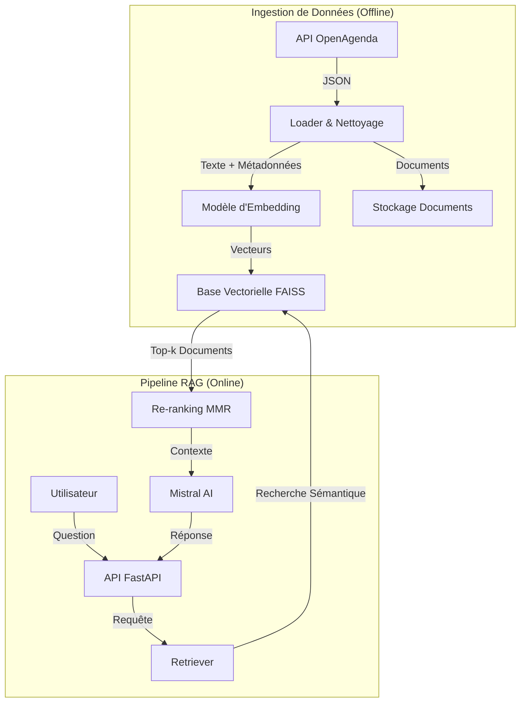

# Rapport Technique – Assistant Intelligent de Recommandation d’Événements Culturels

## 1. Objectifs du projet

*   **Contexte** : Puls-Events souhaite innover dans le domaine de la découverte événementielle en proposant une alternative aux moteurs de recherche classiques basés sur des mots-clés. L'objectif est de créer une expérience utilisateur plus fluide et conversationnelle.
*   **Problématique** : Les utilisateurs ont souvent des requêtes complexes ("Que faire ce week-end avec des enfants ?", "Concert de jazz gratuit dans le Marais") que les filtres traditionnels peinent à satisfaire. Un système RAG (Retrieval-Augmented Generation) permet de comprendre l'intention sémantique de l'utilisateur et de croiser ces informations avec une base de données structurée.
*   **Objectif du POC** : Démontrer la faisabilité technique d'un assistant capable de répondre en langage naturel à des questions sur l'agenda culturel parisien, en utilisant des données réelles et mises à jour, tout en évaluant la pertinence des réponses générées.
*   **Périmètre** :
    *   **Zone géographique** : Paris (tous arrondissements).
    *   **Données** : Événements culturels (concerts, expositions, théâtre, etc.) issus d'OpenAgenda.
    *   **Période** : Événements actuels et futurs (fenêtre glissante).

## 2. Architecture du système

### Schéma global



### Technologies utilisées

*   **Langage** : Python 3.12
*   **Orchestration** : LangChain
*   **Base Vectorielle** : FAISS (Facebook AI Similarity Search)
*   **LLM** : Mistral AI (`mistral-small-latest`) via API
*   **Embeddings** : `intfloat/multilingual-e5-base` (HuggingFace / SentenceTransformers)
*   **API** : FastAPI

## 3. Préparation et vectorisation des données

*   **Source de données** : API OpenAgenda. Nous ciblons les agendas publics de la ville de Paris.
*   **Nettoyage** :
    *   Suppression des balises HTML dans les descriptions (`<p>`, `<br>`, etc.).
    *   Normalisation des catégories (mapping vers une taxonomie fixe : Musique, Théâtre, etc.).
    *   Déduplication des événements (basée sur le titre, le lieu et la date) pour éviter la redondance dans le contexte du LLM.
*   **Chunking** : Le découpage est basé sur l'entité "Événement". Chaque événement constitue un document unique. Nous concaténons le titre, la description courte et les informations clés (lieu, date) pour former le texte à vectoriser.
*   **Embedding** :
    *   **Modèle** : `intfloat/multilingual-e5-base`.
    *   **Dimensionnalité** : 768 dimensions.
    *   **Logique** : Utilisation du préfixe "passage: " pour les documents et "query: " pour les requêtes (spécifique au modèle E5).

## 4. Choix du modèle NLP

*   **Modèle sélectionné** : `mistral-small-latest` (Mistral AI).
*   **Pourquoi ce modèle ?**
    *   **Performance en Français** : Modèle natif français, excellent pour comprendre les nuances culturelles et géographiques de Paris.
    *   **Coût/Efficacité** : Très bon rapport qualité/prix pour des tâches de raisonnement simple (RAG).
    *   **Latence** : Réponse rapide adaptée à un chatbot.
*   **Prompting** :
    *   **Rôle** : "Assistant concierge d'événements pour Paris".
    *   **Contraintes** : Interdiction d'inventer des événements (hallucination), obligation de citer le lieu et la date.
    *   **Structure** : `[Instructions Système] + [Contexte (Liste d'événements)] + [Question Utilisateur]`.
*   **Limites** : Fenêtre de contexte limitée (bien que suffisante pour 10-20 événements), dépendance à l'API externe.

## 5. Construction de la base vectorielle

*   **Moteur** : FAISS (CPU).
*   **Index** : `IndexHNSWFlat` (Hierarchical Navigable Small World) pour une recherche approximative rapide et efficace.
*   **Stratégie de persistance** :
    *   **Index** : Sauvegardé sous `data/index/faiss/index.faiss`.
    *   **Documents** : Stockés dans `data/index/faiss/docstore.pkl` (Pickle) pour récupérer les métadonnées complètes après la recherche vectorielle.
    *   **Mapping** : `index_to_docstore_id.pkl` pour lier les vecteurs aux documents.
*   **Métadonnées associées** : Titre, Date de début, Nom du lieu, Ville, Arrondissement, Prix (bucket), URL, Catégories.

## 6. API et endpoints exposés

*   **Framework** : FastAPI.
*   **Endpoints clés** :
    *   `POST /ask` : Point d'entrée principal. Prend une question en JSON, retourne une réponse en langage naturel et la liste des événements structurés.
    *   `POST /rebuild` : Déclenche la mise à jour de l'index (protégé par token).
*   **Format** :
    *   **Requête** : `{"question": "Concerts de jazz ce soir"}`
    *   **Réponse** : `{"answer": "Voici des concerts...", "events": [...], "filters_applied": {...}}`
*   **Exemple d'appel** :
    ```bash
    curl -X POST "http://localhost:8000/ask" \
         -H "Content-Type: application/json" \
         -d '{"question": "Expos gratuites ce week-end"}'
    ```
*   **Gestion des erreurs** : Gestion gracieuse des timeouts LLM et des index non trouvés.

## 7. Évaluation du système

*   **Jeu de test** : 31 paires (Question / Réponse de référence) générées semi-automatiquement à partir des données réelles.
*   **Métriques** :
    *   **Similarité Sémantique** (Cosine Similarity) : Mesure la proximité du sens entre la réponse générée et la vérité terrain.
    *   **Taux de Couverture** : Pourcentage de questions pour lesquelles au moins un événement pertinent a été trouvé.
    *   **Score de Satisfaction** : Métrique composite (Similarité + Présence d'événements + Latence).
*   **Résultats obtenus** :
    *   **Similarité Sémantique** : **0.84** (Très bon alignement sémantique).
    *   **Taux de Couverture** : **52%** (Le système trouve des événements pour la moitié des requêtes spécifiques du jeu de test).
    *   **Score de Satisfaction** : **0.70** (Bonne expérience utilisateur globale).
*   **Analyse** : Le système excelle à formuler des réponses naturelles et précises quand l'information est présente. Le taux de couverture de 52% s'explique par la nature très spécifique de certaines questions du jeu de test par rapport à la base d'événements chargée (fenêtre temporelle restreinte).

## 8. Recommandations et perspectives

*   **Points forts** :
    *   Architecture modulaire et robuste.
    *   Excellente qualité rédactionnelle des réponses (grâce à Mistral).
    *   Gestion efficace du multilingue (Français/Anglais).
*   **Limites du POC** :
    *   **Ingestion** : Le processus est "batch" (pas de temps réel).
    *   **Volumétrie** : FAISS en mémoire locale est limité par la RAM du serveur.
*   **Améliorations possibles** :
    *   **Production** : Migrer vers une base vectorielle gérée (Qdrant, Pinecone) pour la scalabilité.
    *   **Fonctionnalités** : Ajouter un filtrage géographique plus fin (par quartier et non plus seulement par arrondissement).
    *   **Performance** : Utiliser l'accélération GPU pour la génération des embeddings lors de l'ingestion.

## 9. Organisation du dépôt GitHub

*   `api/` : Code de l'API FastAPI (`main.py`, modèles Pydantic).
*   `rag/` : Cœur du moteur RAG.
    *   `index/` : Gestion de FAISS et des embeddings.
    *   `ingest/` : Scripts de chargement et nettoyage des données OpenAgenda.
    *   `pipeline/` : Logique de génération, retrieval et orchestration.
*   `scripts/` : Scripts utilitaires (`build_index.py`, `generate_qa_dataset.py`).
*   `data/` : Stockage local des index et caches.
*   `evaluation/` : Scripts et résultats d'évaluation (`evaluate.py`, `results.json`).
*   `docs/` : Documentation utilisateur et architecture.

## 10. Annexes

**Exemple de réponse JSON :**
```json
{
  "answer": "J'ai trouvé un concert de jazz intéressant pour vous...",
  "events": [
    {
      "title": "Jazz à la Villette",
      "start_datetime": "2025-09-04T20:00:00",
      "venue_name": "Philharmonie de Paris",
      "price": "30€"
    }
  ]
}
```
