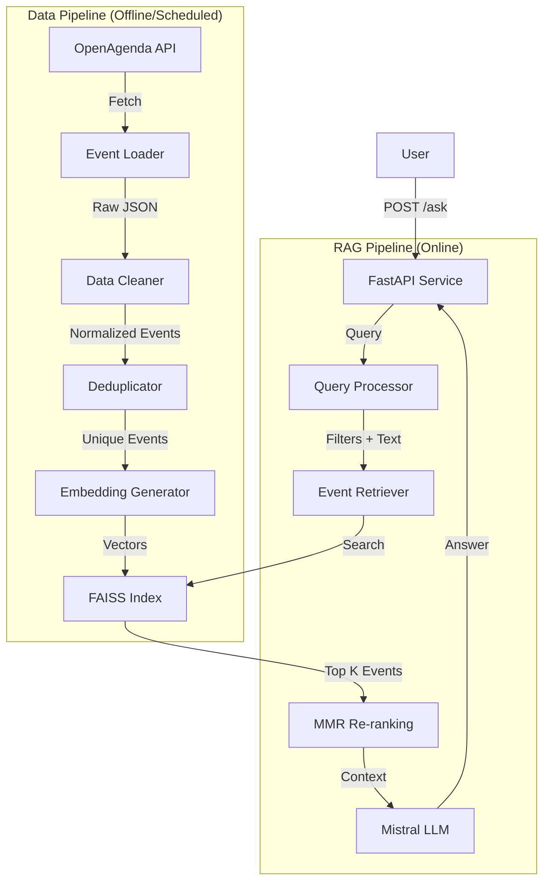

# Architecture & Design Decisions

This document details the technical architecture of AgendaFlow and explains the reasoning behind key design choices.

## System Overview

AgendaFlow is a Retrieval-Augmented Generation (RAG) system designed to answer natural language questions about events in Paris. It is built as a self-contained service that ingests data, builds a vector index, and serves an API.

### High-Level Architecture

## Component Details

### 1. Data Ingestion Layer

*   **Source**: OpenAgenda API (public event data).
*   **Strategy**: We fetch events for a specific city (Paris) within a rolling window (e.g., past 365 days to future 180 days).
*   **Cleaning**:
    *   **HTML Stripping**: Descriptions often contain HTML, which confuses embedding models. We strip tags and decode entities.
    *   **Normalization**: Categories are mapped to a fixed taxonomy (Music, Theater, etc.) to enable reliable filtering.
    *   **Price Bucketing**: Prices are parsed into buckets (Free, Low, Medium, High) to handle the wide variety of price string formats.
*   **Deduplication**: Events often appear in multiple agendas (e.g., a venue agenda and a city-wide agenda). We deduplicate based on title similarity, venue, and date to prevent the LLM from seeing the same event multiple times in the context.

### 2. Indexing Layer

*   **Embedding Model**: `intfloat/multilingual-e5-base`
*   **Vector Store**: FAISS (Facebook AI Similarity Search)
*   **Storage**: Local file system (`.index` file + metadata).

### 3. Retrieval Layer

*   **Search**: Dense vector search using Cosine Similarity (via Inner Product on normalized vectors).
*   **Filtering**: Pre-filtering is applied before vector search where possible, or post-filtering if using a simple FAISS index.
*   **Re-ranking**: We use Maximal Marginal Relevance (MMR) to re-rank results. This ensures diversity in the returned events, preventing the system from returning 5 nearly identical results for the same festival.

### 4. Generation Layer

*   **LLM**: Mistral AI (`mistral-small-latest`).
*   **Prompting**: A structured prompt provides the LLM with the user's question, the retrieved event context (formatted as a list), and current date/time context.

## 5. Evaluation

We maintain a rigorous evaluation pipeline to ensure the quality of the RAG system.

*   **Methodology**: We use a generated test set of Q&A pairs derived from the actual event data.
*   **Metrics**:
    *   **Semantic Similarity**: Measures the accuracy of the generated answer against a ground truth.
    *   **Response Coverage**: Tracks how often the system successfully finds relevant events.
    *   **Satisfaction Score**: A composite metric balancing accuracy, coverage, and latency.
*   **Documentation**: For detailed information on how these metrics are calculated and how to run the evaluation, please refer to [evaluation/README.md](../evaluation/README.md).

## Key Design Decisions

### Embedding Model: `intfloat/multilingual-e5-base`

*   **Why this model?**
    *   **Multilingual Support**: Our users may ask questions in French or English, and the event data is primarily in French but may contain English. E5-base handles both languages effectively in the same vector space.
    *   **Performance**: It consistently ranks highly on the MTEB (Massive Text Embedding Benchmark) leaderboard for retrieval tasks.
    *   **Size vs. Quality**: The "base" model (approx. 500MB) offers a sweet spot between retrieval quality and inference latency on CPU.
*   **Dimensions**: 768. This is the native output dimension of the BERT-base architecture underlying E5.
*   **Prefixing**: We strictly follow the E5 protocol of prefixing "passage: " to documents and "query: " to queries. This asymmetric training is crucial for its retrieval performance.

### Batch Size: 32

*   **Choice**: 32 is selected as a conservative default for CPU-based ingestion.
*   **Reasoning**:
    *   **Memory**: Keeps RAM usage predictable during the embedding phase.
    *   **Latency**: On a standard CPU, a batch of 32 texts can be processed in a reasonable time without blocking the event loop for too long if we were to move to async ingestion (though currently ingestion is a batch script).
    *   **Throughput**: Larger batches (e.g., 128+) provide diminishing returns on CPU and risk OOM errors on smaller container instances.

### Vector Store: FAISS (CPU)

*   **Why FAISS?**
    *   **Efficiency**: It is the industry standard for efficient similarity search.
    *   **Simplicity**: For a dataset of thousands or tens of thousands of events (Paris scale), a local FAISS index is orders of magnitude faster and cheaper than managing a dedicated vector database (like Pinecone, Qdrant, or Milvus).
    *   **Deployment**: The index is just a file. This makes the service stateless (except for the loaded index) and easy to containerize.
*   **Index Type**: `IndexFlatIP` (Inner Product). Since vectors are normalized, this is equivalent to Cosine Similarity. We use a flat index (exact search) because the dataset size (< 100k events) does not yet require approximate search (HNSW/IVF) for low latency.

### LLM: Mistral AI

*   **Why Mistral?**
    *   **French Proficiency**: Being a French model, Mistral handles French nuances in event descriptions and user queries exceptionally well.
    *   **Cost/Performance**: `mistral-small` is highly cost-effective while providing reasoning capabilities sufficient for RAG.
    *   **Context Window**: Sufficient to hold 10-20 detailed event descriptions.

### Retrieval Strategy: MMR (Maximal Marginal Relevance)

*   **Problem**: A query for "jazz concerts" might return 5 sessions of the *same* concert series at the same venue.
*   **Solution**: MMR selects documents that are similar to the query but dissimilar to documents already selected.
*   **Parameters**:
    *   `k_initial`: 12 (Fetch more candidates than needed)
    *   `k_final`: 5 (Return only the best)
    *   `lambda`: 0.3 (Diversity factor). A lower value favors diversity more than strict relevance.

## Scalability Considerations

*   **Current Limits**: The current "Flat" index works well up to ~100k vectors.
*   **Future Scaling**:
    *   **Index**: Switch to `IndexIVFFlat` or `HNSW` for datasets > 1M vectors.
    *   **Ingestion**: The current `build_index.py` is a batch process. For real-time updates, we would need to implement an incremental indexing strategy or use a managed vector DB.
    *   **Compute**: Embedding generation is the bottleneck. Moving to GPU inference would speed up indexing by 10-50x.
